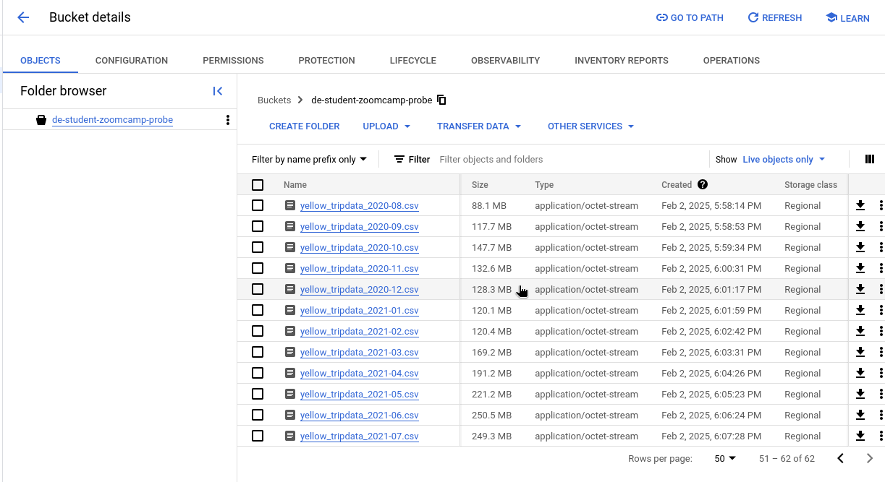

# Home Work Week #2

## 01) Within the execution for `Yellow` Taxi data for the year `2020` and month `12`: what is the uncompressed file size (i.e. the output file `yellow_tripdata_2020-12.csv` of the `extract` task)?

- 128.3 MB
- 134.5 MB
- 364.7 MB
- 692.6 MB 

 

- 128.3 MB

## 02) What is the rendered value of the variable `file` when the inputs `taxi` is set to `green`, `year` is set to `2020`, and `month` is set to `04` during execution?

- `{{inputs.taxi}}_tripdata_{{inputs.year}}-{{inputs.month}}.csv` 
- `green_tripdata_2020-04.csv`
- `green_tripdata_04_2020.csv`
- `green_tripdata_2020.csv`

 

- `green_tripdata_2020-04.csv`


## 03) How many rows are there for the `Yellow` Taxi data for all CSV files in the year 2020?

- 13,537.299
- 24,648,499
- 18,324,219
- 29,430,127

 

```sql
SELECT count(1) FROM `terraform-probe-448818.zoomcamp.yellow_tripdata` 
where filename like "%_2020_%"
```

- 24,648,499


## 04) How many rows are there for the `Green` Taxi data for all CSV files in the year 2020?

- 5,327,301
- 936,199
- 1,734,051
- 1,342,034

 

```sql
SELECT count(1) FROM `terraform-probe-448818.zoomcamp.yellow_tripdata` 
where filename like "%_2020_%"
```
- 1,734,051

## 05) How many rows are there for the `Yellow` Taxi data for the March 2021 CSV file?

- 1,428,092
- 706,911
- 1,925,152
- 2,561,031

```sql
SELECT count(1) FROM `terraform-probe-448818.zoomcamp.yellow_tripdata` 
where filename like "%_2021_03%"
```

 

- 1,925,152

## 06) How would you configure the timezone to New York in a Schedule trigger?

- Add a `timezone` property set to `EST` in the `Schedule` trigger configuration  
- Add a `timezone` property set to `America/New_York` in the `Schedule` trigger configuration
- Add a `timezone` property set to `UTC-5` in the `Schedule` trigger configuration
- Add a `location` property set to `New_York` in the `Schedule` trigger configuration

From documentation of **Schedule** task:

`timezone`

-    Type: string
-    Dynamic: ❌
-    Required: ❌
-    Default: Etc/UTC

The time zone identifier (i.e. the second column in the Wikipedia table) to use for evaluating the cron expression. Default value is the server default zone ID.

| Country code(s) |	TZ identifier |	Embedded comments |	Type |
|:----------------|:--------------|:------------------|:-----|
|US 	          |America/New_York |	Eastern (most areas) |	Canonical |

Second column has value **America/New_York**

- Add a `timezone` property set to `America/New_York` in the `Schedule` trigger configuration
